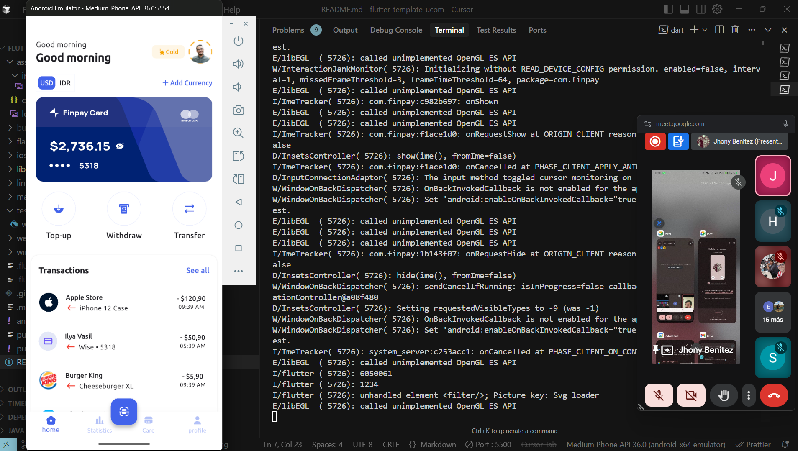

# FinPay



> **Este proyecto fue realizado para cumplir con la materia de _Programación de Dispositivos Móviles_**
>
> 

FinPay es una plantilla de aplicación Flutter moderna y personalizable, ideal para proyectos de banca, finanzas o billeteras digitales. Incluye gestión de temas, navegación, internacionalización y una arquitectura escalable basada en GetX.

## Características principales

- **Pantalla de inicio (Home):** Vista general de cuentas, tarjetas y accesos rápidos a funciones como transferencias y recargas.
- **Estadísticas:** Visualización de gastos, ingresos y análisis por semana, mes o año.
- **Gestión de tarjetas:** Visualización y administración de tarjetas bancarias.
- **Perfil de usuario:** Información personal, edición de perfil y acceso a configuraciones.
- **Configuración:** Cambia el tema (claro/oscuro), gestiona notificaciones, privacidad, ayuda y cierre de sesión.
- **Internacionalización:** Soporte multilenguaje (español por defecto, inglés como fallback).

## Estructura del proyecto

```
lib/
├── config/         # Temas, estilos y traducciones
├── controller/     # Controladores GetX para lógica de negocio
├── model/          # Modelos de datos
├── view/           # Vistas principales (pantallas)
│   ├── home/
│   ├── statistics/
│   ├── card/
│   ├── profile/
│   └── ...
├── widgets/        # Widgets reutilizables
└── main.dart       # Punto de entrada de la app
assets/
├── images/         # Imágenes y recursos gráficos
└── country_code.json # Datos de países
```

## Dependencias principales
- [Flutter](https://flutter.dev/) 3.x
- [GetX](https://pub.dev/packages/get)
- [Google Fonts](https://pub.dev/packages/google_fonts)
- [flutter_svg](https://pub.dev/packages/flutter_svg)
- [card_swiper](https://pub.dev/packages/card_swiper)
- [pinput](https://pub.dev/packages/pinput)

## Instalación y ejecución

1. **Clona el repositorio:**
   ```sh
   git clone <repo-url>
   cd flutter-template-ucom
   ```
2. **Instala dependencias:**
   ```sh
   flutter pub get
   ```
3. **Ejecuta la app:**
   ```sh
   flutter run
   ```

## Internacionalización (i18n)
- Español es el idioma por defecto.
- Puedes agregar más idiomas editando `lib/config/translation.dart`.

## Requisitos
- Flutter 3.29.3 o superior
- Android SDK, Xcode o herramientas para tu plataforma

## Créditos
- Plantilla desarrollada por el equipo de FinPay.
- Basada en Flutter y GetX.

## Licencia
Este proyecto es solo para fines educativos y de demostración. Puedes adaptarlo según tus necesidades.
